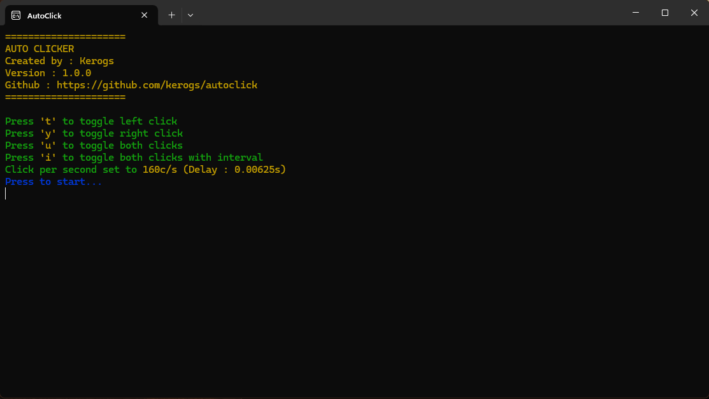

# Auto click
Most simple autoclick

## Installation
1. [Install](https://github.com/kerogs/autoclick/releases/latest) and run the installer
2. You can use it!

## Configuration
1. Change value in ``config.ini``. You can found it in ``C:\Program Files\KS-AutoClick``

### Value
|Name|Value (default)|Description|
|-|:-:|-|
|TOGGLE_LEFT|``t``|Left-click only mode.|
|TOGGLE_RIGHT|``y``|Mode for right-click only.|
|TOGGLE_BOTH|``u``|Mode for both left-click and right-click.|
|TOGGLE_BOTH_INTERVAL|``i``|Mode for both left-click and right-click with an interval.|
|CLICK_PER_SECOND|``160``|Click per second.|
|CLICK_BOTH_DELAY|``0.05``|Delay between left and right click for TOGGLE_BOTH_INTERVAL mode in seconds.|

## How to use
Click on one of the configured keys. This activates the desired mode. By selecting a new mode, all others will be disabled by default. To be on the safe side, if you press a key other than the one given. The auto clicker will be paused.

## Click table
|Time|Click per second ``c/s``|
|:-:|:-:|
|1|1c/s|
|0.1|10c/s|
|0.01|100c/s|
|0.001|1000c/s|